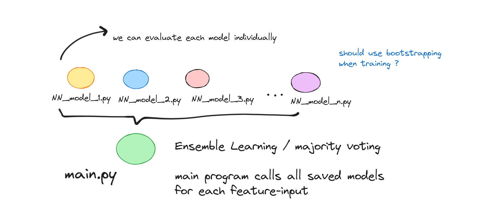

# Fall_Detection_NN
project for AY23 Neural Networks

# Dataset
## Potential DataSet links
https://universe.roboflow.com/roboflow-universe-projects/fall-detection-ca3o8/dataset/4

https://falldataset.com/

http://fenix.ur.edu.pl/~mkepski/ds/uf.html
## Datasets
+ https://iiw.kuleuven.be/onderzoek/advise/datasets#High%20Quality%20Fall%20Simulation%20Data

Run `notebooks/extract_frames_from_videos.ipynb` to extract the frames from videos

# Potential uniquness
use ensemble learning to have mutliple models, and evaluate them using the main program.

things to note for ensemble learning
1. each model must at least have a classification accuracy of > 0.5 ( we can do verify and prove this during our testing )
2. each model must be independent from other models ( how to train better? maybe bootstrapping, random forest )

# Challenges we encountered

# Discuss failure of models if any
