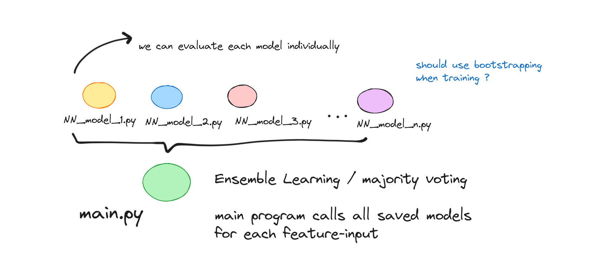

# Fall_Detection_NN
project for AY23 Neural Networks

# Dataset
## Potential DataSet links
https://universe.roboflow.com/roboflow-universe-projects/fall-detection-ca3o8/dataset/4

https://falldataset.com/

http://fenix.ur.edu.pl/~mkepski/ds/uf.html
## Datasets
+ https://iiw.kuleuven.be/onderzoek/advise/datasets#High%20Quality%20Fall%20Simulation%20Data

Run `notebooks/extract_frames_from_videos.ipynb` to extract the frames from videos

# Potential uniquness
use ensemble learning to have mutliple models, and evaluate them using the main program.

things to note for ensemble learning
1. each model must at least have a classification accuracy of > 0.5 ( we can do verify and prove this during our testing )
2. each model must be independent from other models ( how to train better? maybe bootstrapping, random forest )
3. use an odd number of models.(maybe 3?)

# Challenges we encountered
1. Imbalanced Data: Fall detection datasets often have imbalanced classes, with fewer fall instances compared to non-fall instances. Handling class imbalance is a challenge in training models effectively.  

ANS: Technically we already addressed this? the dataset that we found was huge

 

1. Real-World Variability: Falls can occur in various settings and under different conditions (e.g., lighting, camera angles, clothing). Your model needs to be robust to these variations.  

ANS: Perhaps we can do some kind of data augmentation?
    Geometric Transformations: Rotating, scaling, shearing, flipping, and translating the images.

    Color and Contrast Adjustments: Changing brightness, contrast, saturation, and hue to create variations in color.

    Noise Injection: Adding random noise or artifacts to simulate real-world imperfections.

    Cropping and Resizing: Cropping and resizing images to different dimensions.

    Blur and Sharpen: Applying blur or sharpen filters to simulate focus variations.

# Discuss failure of models if any
